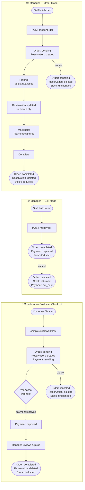
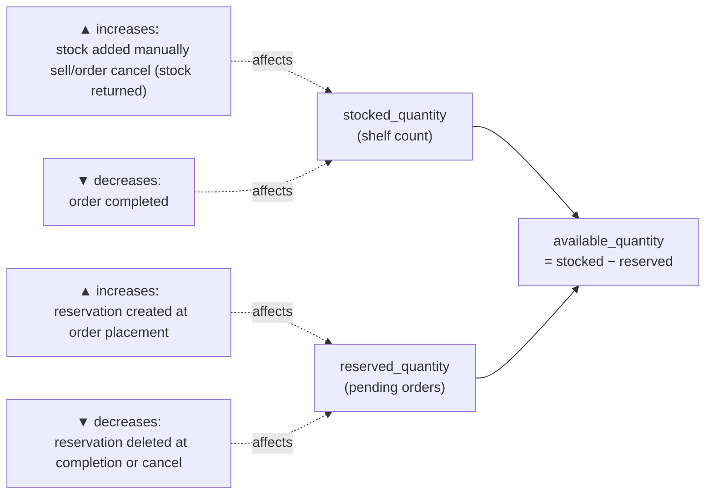
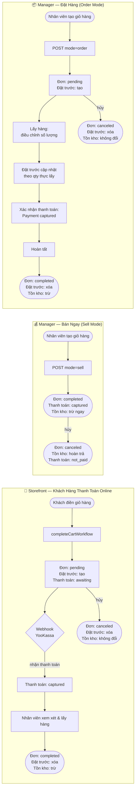
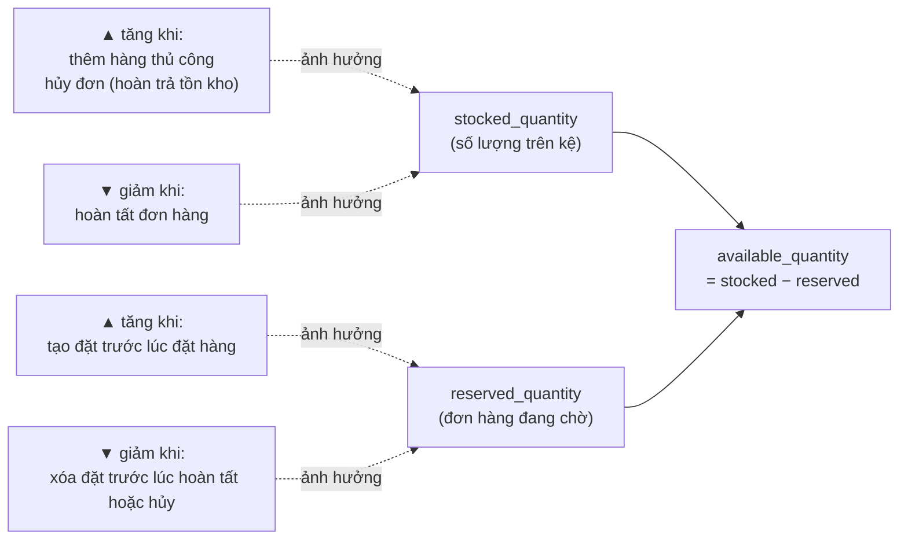

# Order Flow: Stock, Payment, Reservations

Full reference for all order surfaces and use cases.

---

## Core Inventory Concepts

Medusa tracks three numbers per product per warehouse location:

| Field | Meaning |
|---|---|
| `stocked_quantity` | Physical units on the shelf |
| `reserved_quantity` | Units held for pending orders (auto-summed from reservation records) |
| `available_quantity` | `stocked - reserved` — what Medusa shows as available to sell |

**Reservation items** are records linked to a `line_item_id`. Creating one increases `reserved_quantity`. Deleting one releases it. The Medusa admin shows this as the "Allocated / Not allocated" badge on each order line.

Stock deduction (`stocked_quantity` decremented) only happens when an order is completed — never at placement.

---

## Overview Diagram



### Inventory numbers at a glance



---

## Surface 1: Storefront (Customer Checkout)

### Happy path

```
Customer adds items to cart
  → cart has: region, shipping method, payment session
  → completeCartWorkflow():
      1. Creates order (status: pending)
      2. reserveInventoryStep() → creates one reservation item per line item
         reserved_quantity goes up, available_quantity goes down
      3. Creates payment collection (status: awaiting)
  → Customer pays via YooKassa
  → YooKassa webhook hits backend
      → payment captured (captured_at set, collection status: captured)
  → Manager sees order: pending, paid
  → Manager picks and completes order
      → reservations deleted
      → stocked_quantity decremented
      → order status: completed
```

### Stock at each step

| Step | stocked | reserved | available |
|---|---|---|---|
| Before checkout | 10 | 0 | 10 |
| After completeCartWorkflow | 10 | 2 | 8 |
| After manager completes | 8 | 0 | 8 |

### Cancel (before completion)

- Order canceled → reservations auto-deleted by Medusa cancel workflow
- `stocked_quantity` unchanged (was never touched)
- Payment: if already captured, must be refunded separately via YooKassa

---

## Surface 2: Manager App — POS Sell Mode

For walk-in customers paying cash immediately. No pending state, no reservations.

### Flow

```
Staff builds cart → clicks "Bán" (Продать)
  → POST /admin/pos-orders { mode: "sell", items, total }
  → Backend:
      1. Creates order (status: completed)
      2. createOrderPaymentCollectionWorkflow → payment collection created
      3. markPaymentCollectionAsPaid → captured_at set
      4. deductVariantStock() → stocked_quantity decremented immediately
      (No reservation created — not needed for immediate sales)
```

### Stock timeline

| Step | stocked | reserved | available |
|---|---|---|---|
| Before sale | 10 | 0 | 10 |
| After sell | 8 | 0 | 8 |

### Cancel a sell order

```
Staff cancels
  → cancelOrder() — may fail if status=completed, so force: updateOrders({ status: "canceled" })
  → returnVariantStock() → stocked_quantity incremented back
  → metadata: { stock_returned: true }
  → GET endpoint returns payment_status: "not_paid" when order.status = "canceled"
```

Stock returns to 10. Order shows: canceled, not paid.

---

## Surface 2: Manager App — POS Order Mode

For orders fulfilled later (delivery, customer pickup, larger orders). Customer may pay later.

### Phase 1: Order Creation

```
Staff builds cart → clicks "Đặt hàng" (Заказать)
  → POST /admin/pos-orders { mode: "order", items, total }
  → Backend:
      1. Creates order (status: pending)
      2. reserveInventoryForOrder() via createReservationsWorkflow:
         → one reservation item per line item, linked by line_item_id
         → reserved_quantity goes up
      (No payment, no stock deduction)
```

### Phase 2: Picking

Staff goes to warehouse and picks actual items. Quantities may differ from what was ordered.

```
Staff opens order → enters picking mode → adjusts quantities
  → handleFinishPicking() sends:
      PATCH /admin/pos-orders/:id {
        items: [{ action: "update", id, quantity: pickedQty, unit_price }]
      }
  → Backend per item:
      1. updateOrderLineItems(id, { quantity }) — Medusa line item updated
      2. listReservationItems({ line_item_id }) → find existing reservation
      3. updateReservationItems([{ id, quantity: pickedQty }]) — reservation synced
```

If picked quantity changes from 3 → 2, the reservation updates to 2. Admin shows "2× Allocated."

### Phase 3: Mark Paid

```
Staff clicks "Đã thanh toán" (Оплачено)
  → PATCH /admin/pos-orders/:id { mark_paid: true }
  → Backend:
      if already captured → skip (idempotent, safe to call twice)
      if existing non-canceled collection → markPaymentCollectionAsPaid
      if no collection → createOrderPaymentCollectionWorkflow → markPaymentCollectionAsPaid
```

### Phase 4: Complete

```
Staff clicks "Hoàn thành" (Завершить)
  → PATCH /admin/pos-orders/:id { complete: true }
  → Backend (if not already stock_deducted):
      1. listReservationItems({ line_item_id: [all item ids] })
      2. deleteReservationItems → reserved_quantity freed
      3. deductVariantStock() → stocked_quantity decremented by current line item quantities
      4. metadata: { stock_deducted: true }
      5. orderModule.completeOrder(id)
```

### Full stock timeline for order mode

| Step | stocked | reserved | available |
|---|---|---|---|
| Before | 10 | 0 | 10 |
| After create | 10 | 3 | 7 |
| After picking (qty adjusted 3 → 2) | 10 | 2 | 8 |
| After complete | 8 | 0 | 8 |

### Cancel an order-mode order (before complete)

```
Staff cancels
  → cancelOrder() — succeeds for pending orders
  → stock_deducted is false → delete reservations:
      listReservationItems({ line_item_id }) → deleteReservationItems
  → reserved_quantity freed, stocked_quantity untouched
  → payment_status: "not_paid" (no payment was ever captured)
```

### Cancel an order-mode order (after complete)

Not expected in normal flow. If triggered, treated the same as canceling a sell order — stock is returned via `returnVariantStock()`.

---

## Surface 3: Medusa Admin (Back-office)

The admin app reads what your backend has written. It does not drive any of the flows above.

| What admin shows | Source |
|---|---|
| "Allocated" badge | Reservation items exist for `line_item_id` |
| "Not allocated" badge | No reservation items for `line_item_id` |
| Payment status | `payment_collections → payments.captured_at` |
| Order status | `order.status` |
| Activity log | Medusa's internal event system (automatic) |

### Fulfillment vs Completion

These are two separate concepts in Medusa:

| Concept | Meaning | Used in this project? |
|---|---|---|
| **Fulfillment** | Creating a shipment record — packing slip, tracking number, handoff to courier | Not yet — only relevant when integrating a shipping provider (CDEK, etc.) |
| **Completion** | Marking the order lifecycle as done | Yes — the "Complete" button in manager app |

`fulfillment_status` fields (`not_fulfilled`, `fulfilled`, `shipped`, `delivered`) exist in Medusa but are not used by the manager app. The manager only acts on `order.status` and `payment_status`.

---

## Full State Machine

```
STOREFRONT ORDER
┌─────────────────────────────────────────────────────────────────┐
│ cart → completeCartWorkflow                                     │
│   order: pending                                                │
│   reservation: created                                          │
│   payment: awaiting → captured (YooKassa webhook)              │
│                                                                 │
│ cancel: order canceled, reservations deleted, stock unchanged   │
│ complete (manager): reservations deleted, stock deducted,       │
│   order → completed                                             │
└─────────────────────────────────────────────────────────────────┘

MANAGER SELL MODE
┌─────────────────────────────────────────────────────────────────┐
│ POST pos-orders mode=sell                                       │
│   order: completed immediately                                  │
│   reservation: none                                             │
│   payment: captured immediately                                 │
│   stock: deducted immediately                                   │
│                                                                 │
│ cancel: order → canceled, stock returned, payment shown as      │
│   not_paid (derived at API layer)                               │
└─────────────────────────────────────────────────────────────────┘

MANAGER ORDER MODE
┌─────────────────────────────────────────────────────────────────┐
│ POST pos-orders mode=order                                      │
│   order: pending                                                │
│   reservation: created                                          │
│   payment: none yet                                             │
│   stock: untouched                                              │
│                                                                 │
│ picking: quantities adjusted → reservation updated to match     │
│ mark_paid: payment captured (safe to call twice)               │
│                                                                 │
│ complete: reservations deleted, stock deducted, order →         │
│   completed                                                     │
│                                                                 │
│ cancel (before complete): order canceled, reservations deleted, │
│   no stock to return                                            │
└─────────────────────────────────────────────────────────────────┘
```

---

## Key Rules

1. **Reservations** are created at order placement. They are deleted at completion or cancellation. Never left dangling.
2. **Stock deduction** (`stocked_quantity--`) happens only once, at completion. Never at order creation.
3. **Sell mode** skips reservations entirely — stock is deducted immediately at sale time.
4. **Double mark_paid** is safe — the second call is a no-op if already captured.
5. **Cancel always cleans up**: reservations deleted if present; stock returned if it was deducted.
6. **Canceled orders show `payment_status: not_paid`** regardless of what the payment collection record says — this is derived at the API response layer.

---
---

# Luồng Đơn Hàng: Tồn Kho, Thanh Toán, Đặt Trước Hàng

Tài liệu tham khảo đầy đủ cho tất cả các bề mặt và tình huống sử dụng.

---

## Các Khái Niệm Tồn Kho Cơ Bản

Medusa theo dõi ba con số cho mỗi sản phẩm tại mỗi kho:

| Trường | Ý nghĩa |
|---|---|
| `stocked_quantity` | Số đơn vị thực tế trên kệ |
| `reserved_quantity` | Số đơn vị đang giữ cho đơn hàng chờ xử lý (tự động tổng hợp từ các bản ghi đặt trước) |
| `available_quantity` | `stocked - reserved` — số lượng Medusa hiển thị là còn hàng |

**Reservation items (bản ghi đặt trước)** là các bản ghi liên kết với `line_item_id`. Tạo một bản ghi sẽ tăng `reserved_quantity`. Xóa bản ghi sẽ giải phóng nó. Medusa admin hiển thị điều này dưới dạng nhãn "Allocated / Not allocated" (Đã phân bổ / Chưa phân bổ) trên mỗi dòng đơn hàng.

Việc trừ tồn kho (`stocked_quantity` giảm) chỉ xảy ra khi đơn hàng được hoàn tất — không bao giờ xảy ra lúc đặt hàng.

---

## Sơ Đồ Tổng Quan



### Các con số tồn kho



---

## Bề Mặt 1: Storefront (Khách Hàng Thanh Toán Online)

### Luồng bình thường

```
Khách hàng thêm sản phẩm vào giỏ
  → giỏ hàng có: vùng, phương thức giao hàng, phiên thanh toán
  → completeCartWorkflow():
      1. Tạo đơn hàng (trạng thái: pending - chờ xử lý)
      2. reserveInventoryStep() → tạo một bản ghi đặt trước cho mỗi dòng sản phẩm
         reserved_quantity tăng lên, available_quantity giảm xuống
      3. Tạo payment collection (trạng thái: awaiting - chờ thanh toán)
  → Khách hàng thanh toán qua YooKassa
  → Webhook YooKassa gửi về backend
      → Thanh toán được ghi nhận (captured_at được đặt, trạng thái collection: captured)
  → Nhân viên quản lý thấy đơn: pending, đã thanh toán
  → Nhân viên lấy hàng và hoàn tất đơn
      → Các bản ghi đặt trước bị xóa
      → stocked_quantity giảm xuống
      → Trạng thái đơn: completed
```

### Tồn kho theo từng bước

| Bước | stocked | reserved | available |
|---|---|---|---|
| Trước khi thanh toán | 10 | 0 | 10 |
| Sau completeCartWorkflow | 10 | 2 | 8 |
| Sau khi nhân viên hoàn tất | 8 | 0 | 8 |

### Hủy đơn (trước khi hoàn tất)

- Đơn bị hủy → các bản ghi đặt trước tự động xóa bởi Medusa
- `stocked_quantity` không thay đổi (chưa bao giờ bị chạm đến)
- Thanh toán: nếu đã ghi nhận, phải hoàn tiền riêng qua YooKassa

---

## Bề Mặt 2: Manager App — POS Chế Độ Bán Ngay (Sell Mode)

Dành cho khách mua trực tiếp tại quầy, thanh toán tiền mặt ngay lập tức. Không có trạng thái chờ, không có đặt trước hàng.

### Luồng

```
Nhân viên tạo giỏ hàng → nhấn "Bán" (Продать)
  → POST /admin/pos-orders { mode: "sell", items, total }
  → Backend:
      1. Tạo đơn hàng (trạng thái: completed - hoàn tất)
      2. createOrderPaymentCollectionWorkflow → tạo payment collection
      3. markPaymentCollectionAsPaid → captured_at được đặt
      4. deductVariantStock() → stocked_quantity giảm ngay lập tức
      (Không tạo bản ghi đặt trước — không cần cho giao dịch tức thì)
```

### Tồn kho theo từng bước

| Bước | stocked | reserved | available |
|---|---|---|---|
| Trước khi bán | 10 | 0 | 10 |
| Sau khi bán | 8 | 0 | 8 |

### Hủy đơn bán ngay

```
Nhân viên hủy đơn
  → cancelOrder() — có thể thất bại nếu status=completed, nên ép: updateOrders({ status: "canceled" })
  → returnVariantStock() → stocked_quantity tăng trở lại
  → metadata: { stock_returned: true }
  → API trả về payment_status: "not_paid" khi order.status = "canceled"
```

Tồn kho trở lại 10. Đơn hiển thị: đã hủy, chưa thanh toán.

---

## Bề Mặt 2: Manager App — POS Chế Độ Đặt Hàng (Order Mode)

Dành cho đơn hàng giao sau (giao hàng, lấy tại cửa hàng, đơn lớn). Khách có thể thanh toán sau.

### Giai Đoạn 1: Tạo Đơn Hàng

```
Nhân viên tạo giỏ hàng → nhấn "Đặt hàng" (Заказать)
  → POST /admin/pos-orders { mode: "order", items, total }
  → Backend:
      1. Tạo đơn hàng (trạng thái: pending - chờ xử lý)
      2. reserveInventoryForOrder() qua createReservationsWorkflow:
         → một bản ghi đặt trước cho mỗi dòng sản phẩm, liên kết bằng line_item_id
         → reserved_quantity tăng lên
      (Không có thanh toán, không trừ tồn kho)
```

### Giai Đoạn 2: Lấy Hàng (Picking)

Nhân viên ra kho lấy hàng thực tế. Số lượng có thể khác với số lượng đặt hàng.

```
Nhân viên mở đơn → vào chế độ picking → điều chỉnh số lượng
  → handleFinishPicking() gửi:
      PATCH /admin/pos-orders/:id {
        items: [{ action: "update", id, quantity: pickedQty, unit_price }]
      }
  → Backend cho mỗi sản phẩm:
      1. updateOrderLineItems(id, { quantity }) — cập nhật dòng sản phẩm trong Medusa
      2. listReservationItems({ line_item_id }) → tìm bản ghi đặt trước hiện có
      3. updateReservationItems([{ id, quantity: pickedQty }]) — đồng bộ bản ghi đặt trước
```

Nếu số lượng lấy thay đổi từ 3 → 2, bản ghi đặt trước cập nhật thành 2. Admin hiển thị "2× Allocated".

### Giai Đoạn 3: Xác Nhận Thanh Toán

```
Nhân viên nhấn "Đã thanh toán" (Оплачено)
  → PATCH /admin/pos-orders/:id { mark_paid: true }
  → Backend:
      nếu đã ghi nhận → bỏ qua (an toàn khi gọi nhiều lần)
      nếu có collection chưa hủy → markPaymentCollectionAsPaid
      nếu không có collection → createOrderPaymentCollectionWorkflow → markPaymentCollectionAsPaid
```

### Giai Đoạn 4: Hoàn Tất Đơn

```
Nhân viên nhấn "Hoàn thành" (Завершить)
  → PATCH /admin/pos-orders/:id { complete: true }
  → Backend (nếu chưa trừ tồn kho):
      1. listReservationItems({ line_item_id: [tất cả id dòng sản phẩm] })
      2. deleteReservationItems → reserved_quantity được giải phóng
      3. deductVariantStock() → stocked_quantity giảm theo số lượng dòng hiện tại
      4. metadata: { stock_deducted: true }
      5. orderModule.completeOrder(id)
```

### Tồn kho đầy đủ theo chế độ đặt hàng

| Bước | stocked | reserved | available |
|---|---|---|---|
| Ban đầu | 10 | 0 | 10 |
| Sau khi tạo đơn | 10 | 3 | 7 |
| Sau khi lấy hàng (3 → 2) | 10 | 2 | 8 |
| Sau khi hoàn tất | 8 | 0 | 8 |

### Hủy đơn đặt hàng (trước khi hoàn tất)

```
Nhân viên hủy đơn
  → cancelOrder() — thành công với đơn pending
  → stock_deducted là false → xóa bản ghi đặt trước:
      listReservationItems({ line_item_id }) → deleteReservationItems
  → reserved_quantity được giải phóng, stocked_quantity không thay đổi
  → payment_status: "not_paid" (chưa có thanh toán nào được ghi nhận)
```

### Hủy đơn đặt hàng (sau khi hoàn tất)

Không xảy ra trong luồng bình thường. Nếu xảy ra, xử lý giống hủy đơn bán ngay — hoàn trả tồn kho qua `returnVariantStock()`.

---

## Bề Mặt 3: Medusa Admin (Back-office)

Admin app chỉ đọc dữ liệu mà backend đã ghi. Nó không điều khiển bất kỳ luồng nào ở trên.

| Admin hiển thị | Nguồn dữ liệu |
|---|---|
| Nhãn "Allocated" | Bản ghi đặt trước tồn tại cho `line_item_id` |
| Nhãn "Not allocated" | Không có bản ghi đặt trước cho `line_item_id` |
| Trạng thái thanh toán | `payment_collections → payments.captured_at` |
| Trạng thái đơn hàng | `order.status` |
| Nhật ký hoạt động | Hệ thống sự kiện nội bộ của Medusa (tự động) |

### Fulfillment vs Completion (Giao hàng vs Hoàn tất)

Đây là hai khái niệm riêng biệt trong Medusa:

| Khái niệm | Ý nghĩa | Dùng trong dự án này? |
|---|---|---|
| **Fulfillment** (giao hàng) | Tạo bản ghi vận chuyển — phiếu đóng gói, mã theo dõi, bàn giao cho đơn vị vận chuyển | Chưa — chỉ liên quan khi tích hợp đơn vị vận chuyển (CDEK, v.v.) |
| **Completion** (hoàn tất) | Đánh dấu vòng đời đơn hàng là xong | Có — nút "Hoàn thành" trong manager app |

Các trường `fulfillment_status` (`not_fulfilled`, `fulfilled`, `shipped`, `delivered`) tồn tại trong Medusa nhưng không được manager app sử dụng. Manager chỉ xử lý `order.status` và `payment_status`.

---

## Sơ Đồ Trạng Thái Đầy Đủ

```
ĐƠN HÀNG STOREFRONT
┌─────────────────────────────────────────────────────────────────┐
│ giỏ hàng → completeCartWorkflow                                 │
│   đơn hàng: pending                                             │
│   đặt trước: được tạo                                           │
│   thanh toán: awaiting → captured (webhook YooKassa)           │
│                                                                 │
│ hủy: đơn hủy, xóa đặt trước, tồn kho không đổi                 │
│ hoàn tất (nhân viên): xóa đặt trước, trừ tồn kho,              │
│   đơn → completed                                               │
└─────────────────────────────────────────────────────────────────┘

MANAGER — CHẾ ĐỘ BÁN NGAY
┌─────────────────────────────────────────────────────────────────┐
│ POST pos-orders mode=sell                                       │
│   đơn hàng: completed ngay lập tức                             │
│   đặt trước: không có                                           │
│   thanh toán: captured ngay lập tức                            │
│   tồn kho: trừ ngay lập tức                                    │
│                                                                 │
│ hủy: đơn → canceled, hoàn trả tồn kho, thanh toán hiển thị     │
│   là not_paid (tính toán ở tầng API)                           │
└─────────────────────────────────────────────────────────────────┘

MANAGER — CHẾ ĐỘ ĐẶT HÀNG
┌─────────────────────────────────────────────────────────────────┐
│ POST pos-orders mode=order                                      │
│   đơn hàng: pending                                             │
│   đặt trước: được tạo                                           │
│   thanh toán: chưa có                                           │
│   tồn kho: chưa thay đổi                                       │
│                                                                 │
│ lấy hàng: số lượng điều chỉnh → đặt trước cập nhật theo        │
│ xác nhận thanh toán: payment captured (an toàn khi gọi 2 lần)  │
│                                                                 │
│ hoàn tất: xóa đặt trước, trừ tồn kho, đơn → completed          │
│                                                                 │
│ hủy (trước hoàn tất): đơn hủy, xóa đặt trước,                 │
│   không có tồn kho để hoàn trả                                  │
└─────────────────────────────────────────────────────────────────┘
```

---

## Quy Tắc Chính

1. **Bản ghi đặt trước** được tạo khi đặt hàng. Chúng bị xóa khi hoàn tất hoặc hủy. Không bao giờ để thừa.
2. **Trừ tồn kho** (`stocked_quantity--`) chỉ xảy ra một lần, khi hoàn tất. Không bao giờ xảy ra lúc tạo đơn.
3. **Chế độ bán ngay** bỏ qua hoàn toàn bản ghi đặt trước — tồn kho trừ ngay tại thời điểm bán.
4. **Xác nhận thanh toán hai lần** là an toàn — lần gọi thứ hai là no-op nếu đã captured.
5. **Hủy đơn luôn dọn sạch**: xóa bản ghi đặt trước nếu có; hoàn trả tồn kho nếu đã trừ.
6. **Đơn đã hủy hiển thị `payment_status: not_paid`** bất kể bản ghi payment collection nói gì — giá trị này được tính toán ở tầng API response.
